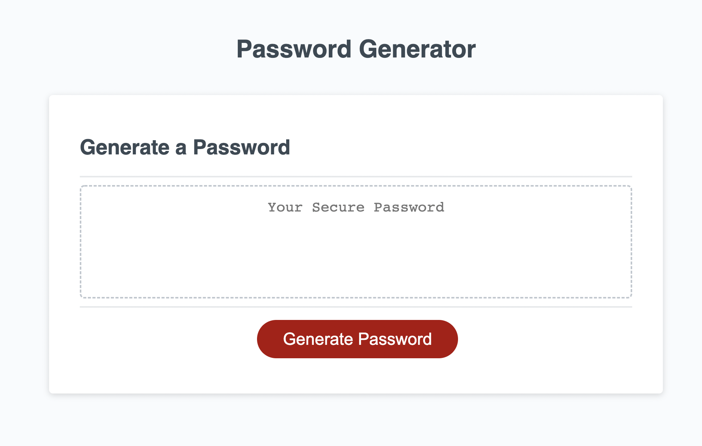
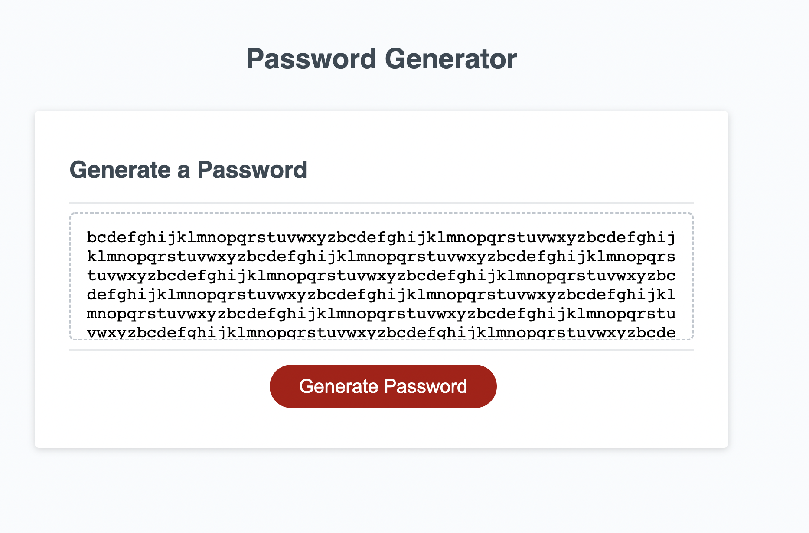

# Password Generator

## Summary of Project

The following project entailed created a password generator that upon clicking the "Generate Password" button, prompted you with an initial question regarding password length and then asked the user to confirm whether or not they would like to include lower- or uppercase letters, numbers, or special characters in their password. If they user decides not to include any of the character types, they are alerted that one type must be included in the password and the function restarts. Once all confirmations have been completed, the program generates a random password including the selected criteria and is presented in a box on the page.

## Technologies and Languages Used

* HTML
* CSS
* JavaScript
* Git
* GitHub

## Project Screenshot

## Author Links

* [GitHub](https://github.com/lilyannekot)
* [Project Website](https://lilyannekot.github.io/password-generator/)
* [LinkedIn](https://www.linkedin.com/in/lilykot/)